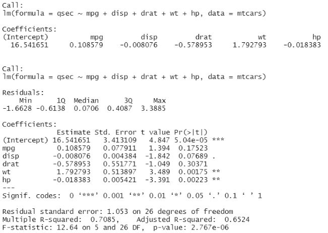
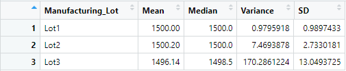
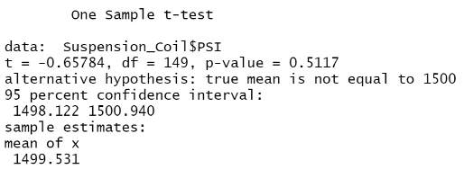

# MechaCar_Statistical_Analysis

## Deliverable 1

1. According to the linear regression function we performed utilizing R, both the weight of the vehicle and AWD influenced the variance of the mpg values in the dataset.

2. The slope of the linear model cannot be considered as zero due to the fact that this is a multiple linear regression analysis with multiple independent variables affecting the dependent vairable. If there is no linear relationship between the independent and dependent vairbales. each dependent variable would be determined by chance and errpr/

3. However, this linear model does not represent an effective represenation. One particular reason is that the input data should be numerical and continuous i.e. following a linear pattern. The R squared value does not support thos being an effective model of predicting mpg.

## Deliverable 2

According to the results, Lot1 and Lot2 have very low variance values in comparison to Lot 3. The current manufacturing data data does not meet the design specifications since Lot 3's variance value falls outside the requirement.

## Deliverable 3

The p value suggests our t test is statistically significant therefore we would not reject the null hypothesis. The same can be said for each lot with a p value of less than 0.05

## Deliverable 4

The purpose of this analysis is to determine if the MechaCar performs better on specific metrics such as mpg against the competition and in order to justify its cost. The specific metrics being measured are :price, HorsePower, and MPG-highway. The Null hypothesis of this analysis would be that there is no significant difference between the MechaCar vs other competitors. The alternative hypothesis being there is a observable difference between the MechaCar and the competition. An anova test would be used to sample for the two distinct groups with the other test being a chi square test in order to determine the frequency between the two groups.
